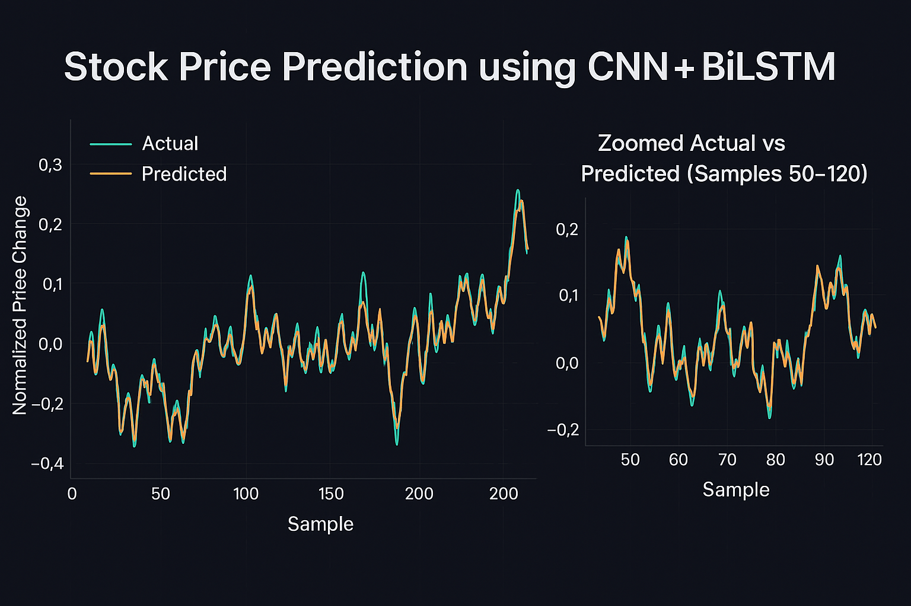

<p align="center">
  
</p>

# 📈 Stock Price Prediction using CNN + BiLSTM

A deep learning model for forecasting stock prices using a hybrid architecture that combines Convolutional Neural Networks (CNN) and Bidirectional LSTM layers.  
This project uses historical Amazon (AMZN) stock data to predict future price movements.

---

## 📌 Overview

This project demonstrates a complete pipeline for stock price prediction:

- Data preprocessing and feature engineering  
- Sliding window sequence generation  
- A hybrid **CNN + BiLSTM** deep learning model  
- Model training and evaluation  
- Saving the trained model for future inference  
- Visualizing prediction results and training performance

---

## 📂 Project Structure

```
project/
│── model.py                 # Clean executable training script with outputs
│── data/
│     └── AMZN.csv           # Dataset
│── images/
│── saved_model/
│     └── model.h5          # Trained model
│── results/
│     ├── loss_curve.png
│     ├── actual_vs_predicted.png
│     ├── zoom_plot.png
│     └── predictions.csv
│── requirements.txt         # Dependencies
│── README.md                # Project documentation
```


---

## 🧠 Model Architecture

The model consists of:

### **1. TimeDistributed CNN layers**
- Extract local temporal patterns  
- Capture short-term fluctuations in stock prices  

### **2. MaxPooling layers**
- Downsample extracted features  
- Reduce noise and dimensionality  

### **3. Bidirectional LSTM layers**
- Learn long-term dependencies  
- Capture forward and backward temporal relationships  

### **4. Dense output layer**
- Predicts the normalized next-day price movement  

---

## 🚀 How to Run

### **1. Install dependencies**
```
pip install -r requirements.txt
```
### **2. Run the training script
```
python model.py
```

### **3. Output

    Trained model saved as: saved_model/model.h5

    Evaluation plots saved in: results/

    Predictions saved in: results/predictions.csv

---

📊 Evaluation

The model is evaluated using:

    Mean Squared Error (MSE)

    Mean Absolute Error (MAE)

Visualizations include:

    Training vs Validation Loss

    Actual vs Predicted (first 200 samples)

    Zoomed Actual vs Predicted (samples 50–120)

All plots are saved in the results/ folder.

---

📘 Notes

    The dataset (AMZN.csv) must be placed inside the data/ directory.

    The model.py  file is a clean, production-ready version of the training pipeline.

    The predictions are normalized percentage changes, not absolute prices.

---

📬 Contact

If you have questions or want to discuss the project, feel free to reach out.

---

📄 License

MIT License